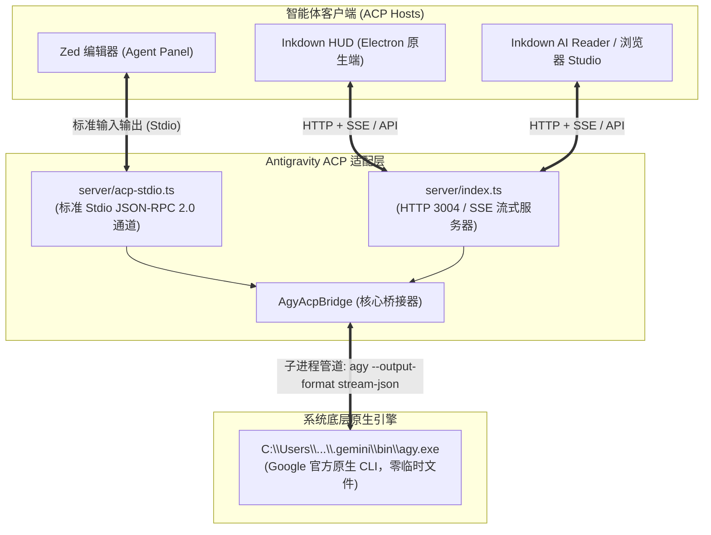
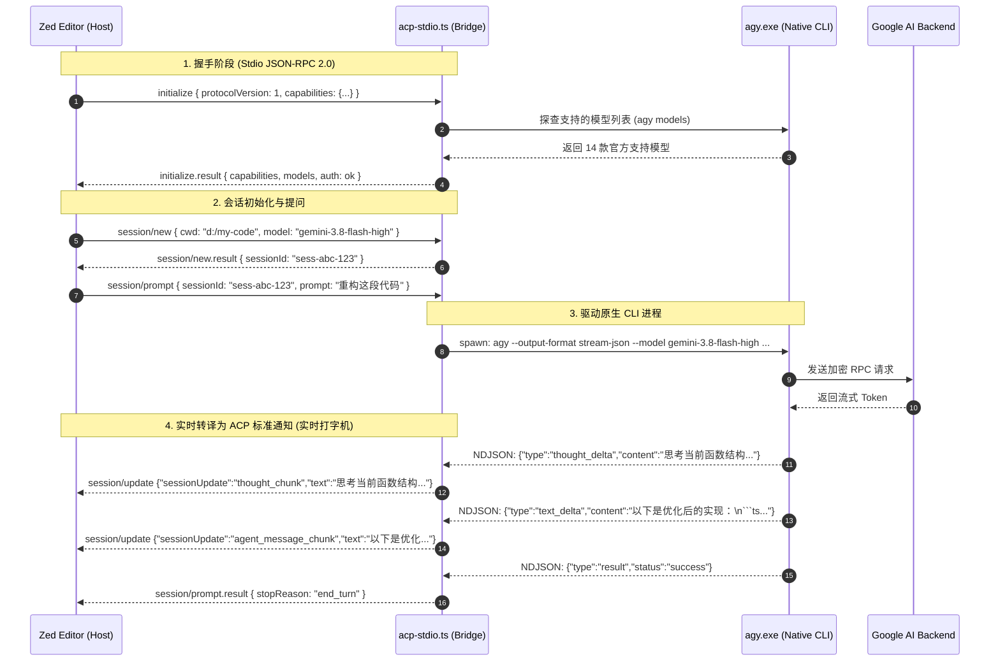

# Antigravity ACP 核心总览与 Zed 编辑器集成完全手册

> **核心结论先知**：
> **是的，本项目经过改造后，可以直接、无缝地作为 Zed 编辑器的官方标准 Agent 接入！**  
> 不仅 Zed 可以直接通过 **Stdio JSON-RPC 2.0** 驱动它，**Inkdown HUD**、**Web Studio** 也可以通过 **HTTP/SSE（端口 3004）** 共享同一套原生核心，且**彻底根治了旧版本吃满 C 盘 14GB 的致命隐患**。

---

## 目录
1. [为什么原先的方案会把 C 盘吃满（原理解密）](#1-为什么原先的方案会把-c-盘吃满原理解密)
2. [我们的改造方案：原生 CLI 双模适配器](#2-我们的改造方案原生-cli-双模适配器)
3. [Zed 编辑器如何直接接入（30 秒极速配置）](#3-zed-编辑器如何直接接入30-秒极速配置)
4. [全链路通信原理全景拆解（从 Zed 点击到 AI 输出）](#4-全链路通信原理全景拆解从-zed-点击到-ai-输出)
5. [双端共生：Zed (Stdio) 与 Inkdown (HTTP/SSE) 并行工作](#5-双端共生zed-stdio-与-inkdown-httpsse-并行工作)
6. [实测验证与常见问题（FAQ）](#6-实测验证与常见问题faq)

---

## 1. 为什么原先的方案会把 C 盘吃满（原理解密）

在上一代方案中，无论多开几次还是重启编辑器，很多开发者的 C 盘都会迅速被吃掉数 GB 甚至数十 GB（本机排查到 12 次残留累计 **14.14 GB**）。

### 根本原因：PyInstaller `--onefile` 解包机制与 Windows 文件锁
旧版官方 ACP 独立运行服务（例如 `agy_acp_server.exe`）是用 Python 打包的，并开启了 `--onefile` 单文件模式：

```
[旧方案运行机制]
agy_acp_server.exe (压缩归档包)
       │
       ▼ (启动时解压完整 Python 运行环境 + PyTorch/DLL 等)
%TEMP%\_MEIxxxxxx\ (单次解包约 1.19 GB 真实磁盘空间！)
       │
       ▼ (运行并加载数十个动态链接库 .dll)
[Windows 操作系统锁定这些 DLL 句柄]
       │
       ▼ (若遭遇 Zed 退出、强杀、热重启或进程异常崩溃)
[清理钩子无法删除被锁定的 DLL] ──> 残留在 C 盘永久无法回收！
```

- **单次消耗**：每次 Zed 启动 Agent 或热重载，都会在 `C:\Users\<用户名>\AppData\Local\Temp\_MEIxxxxxx` 创建一个约 **1.19 GB** 的目录。
- **锁死残留**：在 Windows 上，由于动态链接库（DLL）一旦被加载，操作系统内核会加上独占句柄锁。一旦进程非正常退出或子进程未完全释放，清理函数便无法删除这些文件夹。
- **滚雪球效应**：多开几次会话或反复调试，10 次启动就直接吃掉 **12~14 GB** C 盘空间！

### 本方案的彻底根治方案
我们直接切换为 Google 官方预编译的 **原生 Go 静态二进制文件**（`C:\Users\zheye\.gemini\bin\agy.exe`）：
- **原地运行**：`agy.exe` 是原生静态编译的可执行文件，直接在原目录运行，**不需要也不进行任何临时目录解包**。
- **零 `%TEMP%` 膨胀**：运行 1 次或 10,000 次，临时目录解压占用均为 **0 字节**。
- **秒级拉起**：省略了 1.19 GB 的磁盘 I/O 解压缩过程，进程拉起由 5~8 秒骤降至毫秒级。

---

## 2. 我们的改造方案：原生 CLI 双模适配器

通过融合社区优秀的解析思想（特别是 `hicder/agy-acp` 的 `stream-json` 纯协议转译与 `yitom486/agy-acp-map` 的 `@agentclientprotocol/sdk` 双协议栈），我们构建了一个**架构纯粹、无 C++ 原生构建依赖、跨平台**的适配器：



---

## 3. Zed 编辑器如何直接接入（30 秒极速配置）

Zed 原生支持 **Agent Client Protocol (ACP)** 协议。Zed 启动时会自动作为 ACP Host，通过启动子进程的标准输入输出（`stdio`）来进行 JSON-RPC 2.0 通信。

### 步骤 1：确认启动脚本就绪
在本项目根目录中，已经为您准备好 Windows 专属启动脚本 `run-zed-acp.cmd` 与通用入口 [server/acp-stdio.ts](file:///d:/project/js/Electron/antigravity-acp/server/acp-stdio.ts)：

- 启动脚本位置：`d:\project\js\Electron\antigravity-acp\run-zed-acp.cmd`
- 脚本内已配置：自动定位 `~/.gemini/bin/agy.exe`，并将所有调试诊断日志严格重定向到 `stderr`，保证 `stdout` 是 100% 干净纯粹的 JSON-RPC 报文。

### 步骤 2：在 Zed 中添加 Agent Server 配置
1. 在 Zed 中按下 `Ctrl+,`（或通过菜单选择 `Zed` -> `Settings` -> `Open settings.json`）。
2. 在 `settings.json` 中加入 `agent_servers` 节点：

```json
{
  "agent_servers": {
    "Antigravity CLI": {
      "command": "cmd.exe",
      "args": [
        "/c",
        "d:\\project\\js\\Electron\\antigravity-acp\\run-zed-acp.cmd"
      ],
      "env": {
        "AGY_BIN_PATH": "C:\\Users\\zheye\\.gemini\\bin\\agy.exe"
      }
    }
  }
}
```

> 💡 **备用直接命令方式**（如果您已将 `bun` 加入系统环境变量）：
> ```json
> {
>   "agent_servers": {
>     "Antigravity CLI": {
>       "command": "bun",
>       "args": [
>         "run",
>         "d:/project/js/Electron/antigravity-acp/server/acp-stdio.ts"
>       ]
>     }
>   }
> }
> ```

### 步骤 3：在 Zed 中即刻使用
1. 按快捷键 `Ctrl+?` 打开右侧 **Agent Panel**（智能体助手面板）。
2. 在面板顶部的模型/Agent 下拉菜单中，选择 **`Antigravity CLI`**。
3. 您将看到与官方一致的全部模型列表（`Gemini 3.8 Flash`、`Claude Sonnet 4.6 (Thinking)`、`GPT-OSS 120B` 等）。
4. 输入任何任务需求，即可体验极速流式打字与深度思考（Thinking）折叠块！

---

## 4. 全链路通信原理全景拆解（从 Zed 点击到 AI 输出）

当你点击 Zed 的发送按钮后，整个系统是如何协作的？



### 关键机制保证：
1. **管道绝对纯净**：
   - ACP 协议规定 `stdout` 只能用于 JSON-RPC 2.0 的消息传输，任何一条诸如 `console.log("ready")` 的普通字符串打在 `stdout` 上都会导致 Zed 报错断开。
   - 本项目通过机制设计，所有初始化日志、调试输出、CLI 报错严格走 `stderr`，Zed 会将 `stderr` 写入其后台日志中（可在 Zed 中输入 `zed: open log` 随时观察），保障协议零干扰。
2. **支持随时中断（Cancel）**：
   - 在 Zed 中点击“停止生成”，Zed 发送 `session/cancel`。
   - 适配器会瞬间向后台正在执行的 `agy.exe` 进程发送终止信号（在 Windows 上执行 `taskkill` 树杀），避免后台空跑耗电耗算力。

---

## 5. 双端共生：Zed (Stdio) 与 Inkdown (HTTP/SSE) 并行工作

本项目不仅服务 Zed，还同时作为 **Inkdown HUD 桌面端** 和 **Web Studio** 的统一大脑。两者可以同时运行，互不干扰：

| 使用场景 | 通信渠道 | 入口文件 | 适用客户端 | 优势 |
| :--- | :--- | :--- | :--- | :--- |
| **编辑器编码** | **Stdio** (标准输入输出) | `server/acp-stdio.ts` / `run-zed-acp.cmd` | **Zed Editor**, Claude Desktop, Neovim (ACP 插件) | 无需开端口、随编辑器自启自停、零网络开销 |
| **伴侣应用** | **HTTP / SSE** (默认端口 3004) | `server/index.ts` (`bun run dev` 或 `bun server/index.ts`) | **Inkdown HUD**, Web Studio, 浏览器前端, 手机端 | 支持跨进程访问、RESTful 控制、多客户端共享 |

两个通道共享底层的 **[AgyAcpBridge](file:///d:/project/js/Electron/antigravity-acp/server/bridge/agyBridge.ts)** 与 **Google 本地认证环境**，您在任意一端登录，另一端直接即插即用！

---

## 6. 实测验证与常见问题（FAQ）

### Q1：我怎么验证 C 盘真的不会再被吃满了？
您可以在 PowerShell 中运行以下命令检查当前临时目录中 `_MEI*` 文件夹的数量与体积：
```powershell
Get-ChildItem -Path $env:TEMP -Filter "_MEI*" | Measure-Object -Property Length -Sum
```
- **旧方案**：每次启动对话，文件夹数量 +1，占用体积增加 1.19 GB。
- **新方案**：无论对话多少轮、无论怎样反复开关 Zed，文件夹数量与体积保持为 **0 增长**。

### Q2：我在 Zed 中切换模型，底层生效吗？
**完全生效**。Zed 会在每次发起对话前或切换下拉框时，向适配器下发选择的模型 ID（例如 `gemini-3.8-flash-high`、`claude-sonnet-4-6`）。适配器会自动以 `--model <id>` 参数驱动 `agy.exe`。

### Q3：为什么不需要在页面输入 Google API Key 或扫码登录？
因为 `agy.exe` 已经复用了您机器上的 Antigravity 官方全局凭证（位于 `~/.gemini/` 目录下）。只要您在本机 Antigravity 环境中已经完成过认证，本适配器就能**完全自动继承**该环境，实现零二次配置的真免登体验。

### Q4：Zed 提示 `Executable not found in $PATH: "agy"` 怎么办？
我们在 [server/acp-stdio.ts](file:///d:/project/js/Electron/antigravity-acp/server/acp-stdio.ts) 中加入了**多层自动探测路径**：
1. 优先读取环境变量 `AGY_BIN_PATH` 或 `AGY_BIN`；
2. 自动检查 Windows 默认安装路径 `C:\Users\<用户名>\.gemini\bin\agy.exe`；
3. 自动将 `~/.gemini/bin` 动态注入到运行环境的 `PATH` 中。  
如果您将 `agy.exe` 存放在自定义目录，只需在 `settings.json` 的 `env` 中声明 `"AGY_BIN_PATH": "您的路径"` 即可。

---

## 相关文档导航
- 📐 **架构与原理深入**：[01_architecture_and_principles.md](file:///d:/project/js/Electron/antigravity-acp/docs/01_architecture_and_principles.md)
- 🔌 **Zed 详细集成配置**：[02_zed_integration_guide.md](file:///d:/project/js/Electron/antigravity-acp/docs/02_zed_integration_guide.md)
- 📡 **ACP 协议与 NDJSON 映射字典**：[03_protocol_and_mapping_spec.md](file:///d:/project/js/Electron/antigravity-acp/docs/03_protocol_and_mapping_spec.md)
- 🔐 **认证与会话生命周期白皮书**：[antigravity_acp_auth_and_lifecycle.md](file:///d:/project/js/Electron/antigravity-acp/docs/antigravity_acp_auth_and_lifecycle.md)
