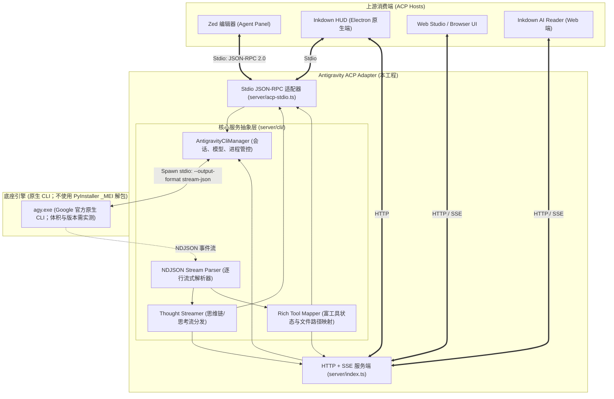

# Antigravity CLI ACP 适配器：架构原理与设计规范（修订版）

本文档系统阐述如何把依赖外部 ACP 服务的方案，重构为**基于原生 Google Antigravity CLI（`agy.exe`）的 Agent Client Protocol (ACP) 适配器**。文档同时区分已经从代码中验证的事实、社区项目的具体实现，以及仍需在目标 `agy` 版本上实测确认的设计目标，避免把经验性结论写成绝对保证。

---

## 1. 背景与历史痛点剖析

### 1.1 外部 ACP 服务的工程风险：PyInstaller `--onefile` 的启动与清理模型
在以往方案中，项目依赖 ACP Registry 下载的外部 Agent 预编译程序（例如 `agy_acp_server.exe` / `localharness_external.exe`）。这里真正需要分析的不是“Python 天生不能做服务”，而是**大型 Python 依赖集合被 PyInstaller `--onefile` 封装后所产生的运行时行为**：

1. **PyInstaller 是什么**：PyInstaller 是 Python 应用的发布工具。它会把 Python 解释器、字节码、动态库和第三方依赖收集到一个可分发的程序中。`--onedir` 通常把这些文件放在一个目录里；`--onefile` 则在启动时先解包到临时目录，再从临时目录运行。
2. **体积问题来自依赖闭包，而不是 ACP 本身**：如果程序捆入 PyTorch、gRPC、科学计算库或其他大型 DLL，最终包和解包目录就可能达到数百 MB 或 GB。本文记录的约 **1.19 GB** 是本机观测值，不应未经复测就当作所有版本、所有机器的固定值。
3. **`_MEI` 目录的生命周期**：`--onefile` 的 bootloader 通常会在 `%TEMP%\_MEIxxxxxx` 下创建一次运行目录，并在正常退出时尝试清理。这个目录不是“内存”，而是真实占用磁盘空间的临时文件集合；多个并发实例会各自拥有目录。
4. **异常退出会放大清理风险**：进程崩溃、被强制终止、编辑器热重载、子进程仍持有 DLL 句柄，或清理阶段遇到权限/杀毒软件/文件锁，都可能使清理不完整。Windows 的文件占用与进程生命周期会让残留目录更难处理，但这不等于每次残留都必然是“死锁”。
5. **本机数据说明的是后果，不是普遍定律**：此前排查到 12 次残留累计约 **14,142.95 MB（超过 14.14 GB）**，说明该部署组合存在严重运维风险。`meiWatchdog.ts`、心跳和 Win32 进程扫描只能做事后回收或缓解，无法改变 `--onefile` 每个实例都要建立独立解包目录的基本模型。

因此，改用已经安装的原生 `agy.exe` 直接作为子进程，主要是在规避 PyInstaller `--onefile` 的解包模型；它并不意味着 Node/Bun 天然优于 Python，也不意味着原生 CLI 永远不会写入配置、会话、缓存或日志文件。

### 1.2 社区现有开源方案的技术走偏与局限
在社区探索将 `agy` CLI 接入 ACP 协议的过程中，先后涌现出几种尝试，但各具局限：

```
[社区路线 A: shindgew/agy-acp]
  Zed/ACP Client
      <--> agy-acp / AcpAgent
      <--> node-pty 驱动交互式 agy
      <--> ~/.gemini/.../<conversation-id>.db 的只读快照
      <--> StreamPoller + Translator
  ⚠️ PTY 主要负责交互式权限提示和诊断输出；该项目并不是把 ANSI 终端文本当作主要 Agent 内容来源。
     主要风险是 node-pty 的原生依赖，以及对私有 SQLite schema、交互式提示文案和终端行为的依赖。

[社区路线 B: shubzkothekar/antigravity-acp]
  Zed/ACP Client
      <--> Bun Stdio ACP adapter
      <--> Bun.spawn agy --print ...（stdout 主要被排空）
      <--> 定时轮询 ~/.gemini/conversations/... 的 SQLite 数据库
      <--> StreamPoller + Translator
  ⚠️ 只读连接并不等于必然发生 EBUSY 或死锁；真正的风险是写入方与读取方之间的
     WAL/快照/提交时序、busy/locked 错误和部分写入边界，以及对 Google 未公开 schema 的强依赖。
     轮询还会带来固定的检测延迟和额外 I/O，并存在“先启动进程、后发现 conversation DB”的竞态。

[社区路线 C: hicder/agy-acp (已归档但思路最纯粹)]
  Zed/ACP Client
      <--> Rust Stdio JSON-RPC 适配器
      <--> agy --output-format stream-json
      <--> stdout NDJSON 事件流（逐行解析）
  🌟 优点：不需要 PTY，也不需要读取 SQLite；可以直接处理 CLI 暴露的
     `init`、`step_update`、`result`、`thought_delta` 和工具事件。
  ⚠️ 局限：Rust 工具链门槛较高；原项目只有 Stdio 入口，没有本地 HTTP/SSE 层；
     权限处理、CLI 参数和事件字段仍然受具体 `agy` 版本约束。
```

---

## 2. 我们的核心方案：双模 Native CLI 适配器

我们确立的原则是：**“放弃弯路，直击官方一等公民接口；兼取众长，打造双模一体化引擎”**。



### 设计目标与实际边界：
1. **避免 PyInstaller 的重复解包**：
   - 如果 `agy.exe` 确实是已经安装的原生可执行文件，适配器直接启动它，就不会再产生 PyInstaller 的 `%TEMP%\_MEIxxxxxx` 解包目录。
   - 这不是“零临时文件”保证：`agy` 仍可能创建 `~/.gemini` 下的会话/缓存/日志，适配器也可能写入自己的状态文件；需要用进程监控和目录观测验证。
2. **降低适配器侧的原生依赖**：
   - 采用 Bun/TypeScript + 标准子进程管道可以避免路线 A 的 `node-pty`；但项目依赖安装、`agy.exe` 本身和其他可选原生模块仍可能有平台要求。
   - 冷启动通常会比“大型 PyInstaller 单文件解包”更可控，但“数十毫秒”必须通过目标机器上的基准测试证明，不能写成固定承诺。
3. **双传输协议并行（目标架构）**：
   - **Stdio 模式**：作为 Zed、Neovim 等 ACP Host 的本地外部 Agent 运行。
   - **HTTP/SSE 模式**：作为本地服务供 Web 前端和 Electron 渲染进程使用。两种入口应共享会话、事件解析和进程管理核心，而不是各自实现一套状态机。

---

## 3. 关键特性与转译原理

### 3.1 深度思考流（Thought / Reasoning Streaming）
当目标版本的 `agy.exe` 和所选模型确实产生 `thought_delta` 时，事件通常位于 `step_update` 中。适配器可以把它转译成 ACP 的 thought update；不能假设所有模型、版本或配置都一定输出该字段，也不应把“是否收到该字段”当作模型内部推理完整可见的证明。

```json
// agy.exe 原生输出
{"event":"step_update","step_update":{"step_type":"agent_response","thought_delta":"正在分析当前模块的依赖关系..."}}

// 适配器转译为 ACP Stdio Notification
{
  "jsonrpc": "2.0",
  "method": "session/update",
  "params": {
    "sessionId": "...",
    "update": {
      "sessionUpdate": "agent_thought_chunk",
      "content": {
        "type": "text",
        "text": "正在分析当前模块的依赖关系..."
      }
    }
  }
}
```
具体字段名和 `content` 结构必须以 ACP SDK/Host 版本为准；例如 `hicder/agy-acp` 使用的是 `agent_thought_chunk`。只有上游 Host 支持该更新类型时，Zed 或 Inkdown HUD 才能展示折叠式的思考流。

### 3.2 结构化富工具调用映射（Rich Tool Execution）
适配器可以借鉴 `hicder` 的精细建模思想，在 CLI 事件确实提供工具名称、调用 ID、路径或结果时，把底层工具操作（例如 `view_file`, `replace_file_content`, `run_command`, `grep_search`）转换为 ACP 结构。可包含：
- `toolCallId`：工具调用的全局唯一追踪 ID；
- `title`：清晰易读的动作概要（如 `Reading src/App.tsx (Lines 1-50)`）；
- `locations`：涉及的具体文件 URI 与行列范围；
- `status`：尽量表达 `running`、`completed` 或 `failed` 生命周期；如果 CLI 没有提供对应事件，适配器只能做有限推断，不能保证每个工具调用都有完整生命周期。

### 3.3 多轮对话原子持久化（Session Persistence & Context Binding）
- 外部客户端每次发起 `session/new` 时分配 ACP 会话标识；适配器再把它绑定到 `agy` 的 `conversation_id`。
- `agy.exe` 如果在首轮通过 `event: "init"` 产出 `conversation_id`，适配器可以持久化这层映射。
- 后续轮次在确认目标 CLI 支持该参数且会话仍存在时，注入 `--conversation <conversation_id>`。
- 这能复用底层会话上下文，但不能承诺“100% 完整继承”：首轮初始化失败、状态文件损坏、会话被 CLI 清理、跨机器迁移，或 `--conversation` 语义变化，都会影响恢复结果。`session/load` 还需要明确是只恢复绑定，还是要向 Host 回放历史。

---

## 4. 修订后的工程结论与验证清单

### 4.1 推荐的核心数据流

```text
ACP Host
  -> Stdio JSON-RPC 或 HTTP/SSE 入口
  -> 统一 Session / Process Manager
  -> spawn agy.exe
  -> stdout: NDJSON stream-json（逐行读取）
  -> Parser / Translator / Tool Mapper
  -> session/update 或 SSE 事件
```

核心原则是优先消费 `agy` 已公开的机器可读输出；不要把终端 UI、ANSI 绘制结果或私有 SQLite 数据库当作主要协议层。SQLite 可以作为 CLI 自身的持久化机制存在，但适配器不应为了“实时流”去读取它。

### 4.2 需要在目标环境中实测的事项

1. `agy --help` 中实际支持的参数、`--output-format stream-json` 的输入方式，以及提示词应通过 `-p`、stdin 还是两者之一传入。
2. stdout 是否始终是一行一个 JSON 对象，stderr 是否包含诊断信息；适配器必须分别读取，不能把日志混入 JSON 流。
3. `init`、文本增量、`thought_delta`、工具事件、错误和最终 `result` 的字段形状；解析器应对未知事件保持向前兼容。
4. `conversation_id` 的生成、恢复和失效行为；应测试首轮、连续多轮、进程重启、并发会话和取消请求。
5. Windows 下的进程树、Ctrl+C/终止、工作目录、环境变量、路径编码以及 stdout/stderr 管道关闭行为。
6. 适配器自身的临时目录、日志和状态文件增长量；“没有 `_MEI`”不等于“没有磁盘写入”。

### 4.3 对三条社区路线的最终判断

- 路线 A 适合在必须驱动交互式终端和权限确认时使用，但同时承担 PTY 原生依赖、终端交互兼容性和私有数据库读取三重复杂度。
- 路线 B 代码入口较轻，然而把 SQLite 轮询当成实时协议层，天然引入检测延迟、快照/锁/竞态问题和 schema 漂移风险。
- 路线 C 的数据边界最干净：ACP 与 CLI 都使用机器可读流，避免 PTY 和 SQLite；它的主要不足是实现语言、Stdio 传输范围、权限交互和 CLI 版本兼容性，而不是数据流方向错误。

因此，本工程更适合以路线 C 的 `stream-json` 读取方式为核心，再用 TypeScript/Bun 补充 HTTP/SSE 入口、统一会话管理、取消和错误处理；是否能达到目标，最终以目标 `agy.exe` 版本的协议实测和回归测试为准。
