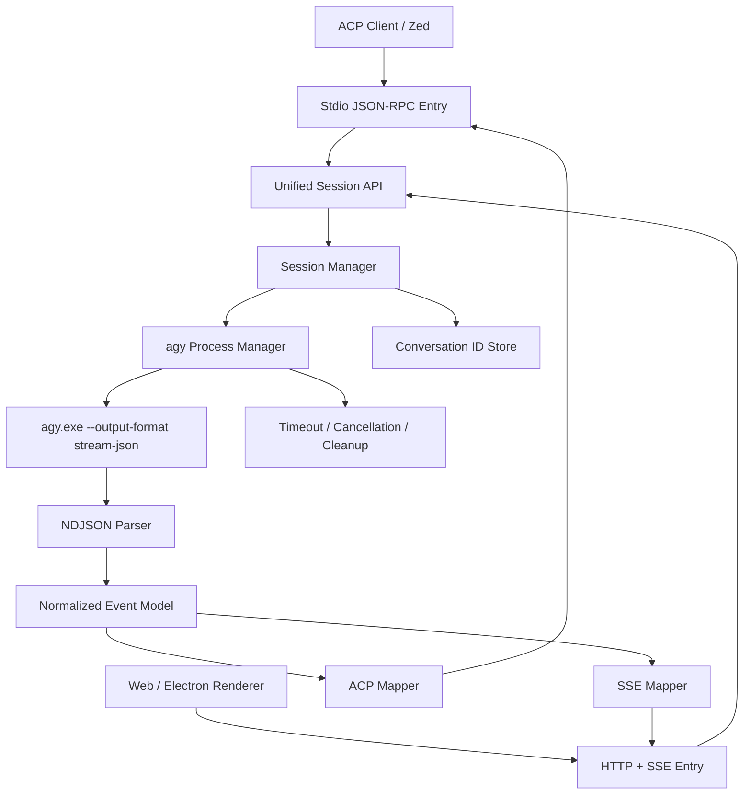

# Antigravity ACP 第一篇扩展说明：问题根因、PyInstaller 与正确架构

本文是 `docs` 目录中三篇扩展说明的第一篇，重点解释以下问题：

- 旧版 Antigravity ACP 服务为什么会产生大量 `%TEMP%\\_MEIxxxxxx` 临时目录；
- PyInstaller 是什么，以及 `--onefile` 的实际运行机制；
- 为什么这个问题不能简单归咎于“Python 不行”；
- 为什么在 ACP 适配器这一层，Node.js/Bun 往往比 Python + PyInstaller 更合适；
- 一个可靠的 Antigravity ACP 适配器应该怎样分层和管理进程。

## 1. 先给结论

这里需要区分三个概念：

1. **ACP**：客户端与 Agent 之间的通信协议；
2. **`agy.exe`**：Google Antigravity 的原生 CLI Agent 引擎；
3. **`agy_acp_server.exe` / `localharness_external.exe`**：过去通过 ACP Registry 获取的外部 ACP 服务。

文档中最严重的磁盘问题，主要来自第三项的打包方式，而不是 ACP 协议本身，也不是 Python 语言本身。

旧架构大致是：

```text
Zed / Electron
      │ ACP
      ▼
agy_acp_server.exe
      │
      ├─ PyInstaller Bootloader
      ├─ Python 解释器
      ├─ Python 依赖和 DLL
      └─ Agent 服务
```

新架构的核心思路是：

```text
Zed / Electron / Web
          │ ACP 或 HTTP/SSE
          ▼
TypeScript/Bun ACP Adapter
          │
          │ spawn
          ▼
agy.exe --output-format stream-json
          │
          ▼
结构化 NDJSON 事件流
```

一句话概括：**旧方案把一个庞大的 Python 运行环境反复解压到临时目录；新方案直接调用已经安装好的原生 CLI，把适配工作放在轻量的协议转换层。**

## 2. 这个 Bug 是怎样一步一步发生的

### 2.1 第一步：ACP Host 启动外部 Agent

当 Zed 或其他 ACP Host 需要使用 Agent 时，会启动 `agy_acp_server.exe`。如果服务的生命周期管理不稳定，下面这些操作都可能产生新的进程：

- 创建新的 ACP 会话；
- Electron 热重载；
- 编辑器重启 Agent；
- 连接断开后自动重连；
- 多个窗口或多个工作区同时使用 Agent。

真正影响磁盘的通常不是“消息数量”，而是**外部 ACP 进程启动了多少次**。

### 2.2 第二步：PyInstaller Bootloader 解压运行环境

`agy_acp_server.exe` 看起来是一个文件，但它内部可能包含完整的 Python 运行环境。启动时，PyInstaller Bootloader 会创建类似下面的目录：

```text
%TEMP%\\_MEI123456
%TEMP%\\_MEI789012
```

然后将 Python、DLL、第三方库和资源文件解压到其中，再从这个目录加载程序。

因此，所谓“单文件”只表示**发布时只有一个文件**，不表示**运行时完全不需要展开文件**。

### 2.3 第三步：每个进程可能占用一份完整副本

如果解压后的运行环境约为 1.19 GB，那么同时启动多个独立进程时，可能得到：

```text
1 个进程  ≈ 1.19 GB
5 个进程  ≈ 5.95 GB
12 个进程 ≈ 14.28 GB
```

文档中记录的 14,142.95 MB，基本符合“约 12 份大型 `_MEI` 目录残留”的现象。

这里主要是**磁盘空间泄漏**，不应与 RAM 内存泄漏混为一谈。

### 2.4 第四步：程序正常退出时才有机会清理

正常情况下，生命周期类似这样：

```text
Agent 启动
  ↓
解压到 _MEI 目录
  ↓
运行 Python 服务
  ↓
服务正常退出
  ↓
Bootloader 尝试删除 _MEI 目录
```

如果服务被强制终止、父进程崩溃，或者子进程仍然存活，最后的清理步骤就可能没有执行，或者执行时删除失败。

### 2.5 第五步：Windows 文件句柄阻止目录删除

Windows 对正在使用的文件有严格的共享和删除规则。以下对象可能仍然持有 `_MEI` 目录内文件的句柄：

- Python 主进程；
- Python 创建的子进程；
- 从临时目录加载的 DLL；
- 工具执行进程；
- 杀毒软件、索引服务或备份程序。

当 Bootloader 尝试删除仍被占用的文件时，可能得到 `Access is denied`、`Sharing violation` 或类似 `EBUSY` 的错误。目录删除失败后，就会成为下一次启动时仍然存在的残留目录。

需要准确理解的是：这不是“Windows 不能删除任何正在打开的文件”，而是某些进程打开文件时不允许删除共享，或者子进程仍在运行，导致删除操作失败。

## 3. PyInstaller 到底是什么

PyInstaller 是一个 Python 应用打包工具。它的目标是让用户在没有安装 Python 环境的情况下运行 Python 程序。

常见的两种模式是：

### 3.1 `--onedir`

打包结果是一个目录：

```text
my-agent/
├── my-agent.exe
├── python DLL
├── third-party DLL
└── 其他依赖文件
```

运行时直接从这个目录加载文件，通常不会每次启动都重新解压，但发布时需要分发整个目录。

### 3.2 `--onefile`

打包结果是一个 EXE：

```text
my-agent.exe
```

但这个 EXE 内部实际上包含一个压缩的依赖包。运行时必须先解压到临时目录，再启动真正的 Python 应用。

它的优势是：

- 用户下载和分发简单；
- 看起来像一个独立程序；
- 不需要用户手动安装 Python。

它的代价是：

- 启动前需要解压；
- 大型依赖会产生巨大临时文件；
- 冷启动速度受磁盘和杀毒软件影响；
- 多实例会重复占用空间；
- 异常退出后可能留下残留目录；
- 运行环境藏在临时目录中，问题排查更困难。

## 4. 为什么说这种技术在本场景中比较落后

“PyInstaller 是落后技术”需要加一个限定：它并不是完全不能使用，也不是所有 Python 桌面程序都不应该使用它。对于小型离线工具，PyInstaller 仍然有实际价值。

但它的设计思路更接近：

> 把一个桌面程序封装成用户可以双击运行的独立文件。

而本项目需要的是：

> 一个高频启动、长期运行、支持多会话、持续输出结构化事件的本地服务。

这两种场景的目标不同。对于 Antigravity ACP，`--onefile` 的问题主要表现在：

### 4.1 运行时展开与服务型程序的目标冲突

服务程序更关心：

- 启动延迟；
- 进程稳定性；
- 可预测的文件位置；
- 多实例资源隔离；
- 异常退出后的恢复。

而 `--onefile` 每次启动都依赖临时展开，增加了这些不确定性。

### 4.2 大型依赖会把打包成本放大

如果 Python 程序只依赖少量标准库，`--onefile` 的问题可能不明显。但加入 PyTorch、gRPC 或其他大型依赖后，临时目录可能达到 GB 级别。

这不是 Python 语言本身造成的，而是“重量级依赖 + 每次解压”的组合造成的。

### 4.3 文件系统和进程生命周期耦合过深

程序是否能正常退出，会直接决定临时目录是否能删除；子进程是否结束，也会影响父进程的清理结果。这使得 ACP Host、Python 服务、工具子进程和 Windows 文件系统之间形成复杂耦合。

### 4.4 单文件并不等于无依赖

`--onefile` 只是把依赖藏进了一个外层文件。运行时仍然需要释放这些依赖，因此它并没有从根本上消除依赖管理问题，只是把问题延迟到了启动阶段。

## 5. 问题不应该简单归咎于 Python

Python 本身并不是这个 Bug 的唯一原因。Python 很适合：

- AI 和机器学习服务；
- 数据处理；
- 快速开发；
- 调用大量 Python SDK；
- 编写独立的后端服务。

真正的问题是下面这组组合：

```text
重量级 Python 依赖
       +
PyInstaller --onefile
       +
高频创建外部进程
       +
Windows 严格文件锁
       +
异常退出和热重载
```

如果使用 Python 虚拟环境或 `--onedir`，并让服务长期运行，也可以构建稳定系统。只是对于本项目的“本地协议适配器”角色，Python 并不是最匹配的技术选择。

## 6. Node.js/Bun 是否更好

对于本项目的**ACP 适配器层**，Node.js 或 Bun 通常更合适，原因不是“Node.js 绝对优于 Python”，而是它与任务类型更匹配。

| 需求 | Node.js/Bun 的优势 |
|---|---|
| 读取 `agy` 输出 | 原生支持流式进程 I/O |
| 解析 NDJSON | JavaScript 字符串和 JSON 处理方便 |
| 提供 HTTP/SSE | Web 生态和库非常成熟 |
| Electron 集成 | Electron 本身就是 JavaScript/Node 生态 |
| 管理多个会话 | 事件循环适合 I/O 密集型任务 |
| 避免 `node-pty` | 直接使用 stdio，不需要伪终端原生模块 |
| 部署适配器 | 可以使用项目已有的 Node/Bun 工具链 |

但是 Node.js 也不是没有问题：

- Node 的单文件打包也可能有自己的资源和启动成本；
- 如果引入大量原生 npm 模块，仍然会遇到编译和平台兼容问题；
- Node 不能自动解决 `agy.exe` 自身的版本、认证和进程管理问题；
- 如果真正的模型推理需要 Python，Node 仍然需要通过服务或子进程调用 Python。

所以更准确的结论是：

> 使用 Node.js/Bun 作为协议适配和进程编排层，使用原生 `agy.exe` 作为 Agent 引擎；如果未来需要 Python 模型服务，则把 Python 隔离在独立的后端服务中。

## 7. 推荐的正确架构

推荐将系统拆成四层：



### 7.1 入口层

入口层只负责接收外部请求：

- Stdio JSON-RPC 入口服务 Zed 等 ACP Host；
- HTTP/SSE 入口服务 Web 和 Electron 渲染进程。

入口层不应该直接解析终端画面，也不应该直接读取 Antigravity 的 SQLite 文件。

### 7.2 会话层

`Session Manager` 负责：

- 分配 ACP `sessionId`；
- 维护工作区、模型和权限信息；
- 把 ACP 会话绑定到一个 `agy` 进程或受控的进程上下文；
- 保存 `sessionId` 与 `conversation_id` 的映射；
- 处理取消、超时和客户端断开。

### 7.3 进程层

`agy Process Manager` 负责：

- 安全地启动 `agy.exe`；
- 将 stdout 作为结构化事件流读取；
- 将 stderr 单独记录，避免污染 JSON 流；
- 处理 Windows 下的进程树终止；
- 防止子进程成为孤儿进程；
- 设置超时、并发上限和背压策略。

### 7.4 事件转换层

建议先把 `agy` 事件转换为内部统一结构，再分别输出 ACP 和 SSE：

```text
agy 原始事件
   ↓
内部事件模型
   ├── ACP session/update
   ├── ACP tool-call 状态
   └── SSE data 事件
```

这样不会让 ACP 细节污染核心进程管理逻辑，也便于未来增加 WebSocket 或其他客户端。

## 8. 这个架构必须具备的安全和稳定性设计

### 8.1 不读取内部数据库

只使用 `agy` 官方输出的 `stream-json`，不要依赖未公开的 SQLite 表结构。

### 8.2 不抓取终端画面

优先使用结构化 stdout，避免 ANSI 转义码、终端宽度和动态刷新造成解析错误。

### 8.3 严格隔离 stdout 和 stderr

stdout 只能输出协议数据。日志、调试信息和错误应写入 stderr 或独立日志文件，否则会破坏 JSON-RPC/NDJSON 解析。

### 8.4 处理异常退出

必须测试：

- 正常关闭；
- ACP 客户端断开；
- 强制终止适配器；
- `agy.exe` 崩溃；
- 工具子进程长时间运行；
- 多会话并发；
- Electron 热重载。

### 8.5 限制 HTTP 暴露范围

本地 HTTP 服务默认应该只监听 `127.0.0.1`，并考虑：

- 认证令牌；
- CORS 限制；
- 工作区路径校验；
- 环境变量过滤；
- 防止任意命令执行权限被暴露到局域网。

### 8.6 不把“零临时文件”理解得过于绝对

新方案的目标是消除 PyInstaller 的 GB 级 `_MEI` 解压目录，而不是保证系统完全不产生任何缓存、日志、认证文件或对话历史。

## 9. 对当前设计目标的准确表述

以下说法比较准确：

- “不再依赖 PyInstaller 单文件启动时的巨量解压”；
- “适配器直接消费 `agy` 的结构化事件流”；
- “通过统一会话管理支持 Stdio 和 HTTP/SSE”；
- “通过原生 CLI 进程降低安装和启动复杂度”。

以下说法需要通过实际测试后再作为确定性结论：

- “临时目录绝对为 0”；
- “启动时间一定只有几十毫秒”；
- “所有模型版本都支持 `thought_delta`”；
- “上下文继承 100% 完整”；
- “所有 `agy` 版本都兼容同一套事件字段”。

这些更适合作为架构目标，而不是未经验证的保证。

## 10. 最终判断

对于 Antigravity ACP，推荐的技术组合是：

```text
TypeScript/Bun
    负责 ACP、HTTP/SSE、会话和进程编排

原生 agy.exe
    负责 Agent 能力和模型交互

stream-json / NDJSON
    负责稳定传输结构化事件

内存或轻量持久化状态
    负责 sessionId 与 conversation_id 的绑定
```

问题的根源不是“Python 不能做 Agent”，而是**用 PyInstaller `--onefile` 将重量级 Python 运行环境封装成高频启动的外部 ACP 服务**。在这个特定场景下，这种运行时解压模式与 Windows 文件锁、ACP 会话生命周期和多实例并发发生了冲突，因此才会出现启动慢、磁盘膨胀、目录残留和清理困难等问题。

